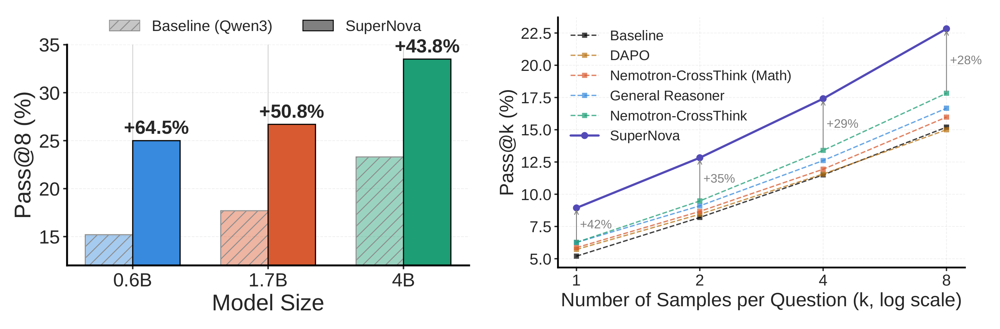
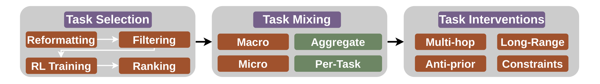

# :sunny: SUPERNOVA: Eliciting General Reasoning in LLMs with Reinforcement Learning on Natural Instructions

<p align="center">
  <a href="https://arxiv.org/abs/2604.08477"></a>
  <a href="https://huggingface.co/datasets/marslabucla/supernova"></a>
  <a href="https://huggingface.co/collections/marslabucla/supernova"></a>
</p>

Reinforcement Learning with Verifiable Rewards (RLVR) has driven large gains in
mathematical and code reasoning, but extending it beyond STEM is bottlenecked by
the scarcity of high-quality *verifiable* training data. **SUPERNOVA** shows that
existing human-annotated instruction-tuning datasets — e.g. SuperNI — are a rich
but underused source of such data, and provides a principled pipeline for turning
them into effective RLVR corpora for general reasoning.

Through **100+ compute-matched RL experiments** we study three data-design choices
and distill them into a **25K-instance** curated dataset spanning **9 reasoning
types** drawn from **31 SuperNI tasks**.

### Key findings

- **Source task selection dominates.** Which tasks you train on matters more than
  any other lever — we observe a 7.6pp pass@8 gap between the best and worst single
  task, and several tasks *degrade* the baseline. Cheap proxies (semantic/lexical
  similarity, base-model difficulty) are poor predictors of task utility; effective
  selection requires compute-matched RL.
- **Micro-mixing wins.** Selecting top-ranked tasks *per validation sub-task*
  (micro-mixing) beats overall-average ranking (macro-mixing). The best mixture is
  surprisingly small — micro top-2.
- **Synthetic interventions don't help.** Difficulty-increasing transforms of
  questions (long-context, anti-prior, constraints, etc.) fail to improve over the
  un-augmented data.

### Headline results

Training **Qwen3** on SUPERNOVA yields up to a **64.4pp relative gain on BBEH** and
beats the strongest reasoning-dataset baseline (Nemotron-CrossThink) by **42pp at
pass@1**. 



> **Figure 1.** Training on SUPERNOVA gives consistent pass@k improvements on
> BBEH-test. **(a)** Gains hold across Qwen3 model sizes (0.6B–4B). **(b)** Under
> compute-matched comparisons, SUPERNOVA outperforms existing reasoning datasets
> across values of *k*.


---

## The SUPERNOVA framework



> **Figure 2.** The SUPERNOVA pipeline studies data-design choices for curating
> RLVR data from natural instruction datasets: task selection, task mixing, and
> synthetic task interventions.


---

## Repository layout

- [`evalchemy/`](evalchemy/) — vendored [Evalchemy](https://github.com/mlfoundations/evalchemy)
  eval harness; entrypoint `python -m eval.eval`.
- [`trl_scripts/`](trl_scripts/) — GRPO training scripts.
  - [`grpo_llm_gr.py`](trl_scripts/grpo_llm_gr.py) — main training script. Loads a HF
    dataset, evaluates on BBEH-mini during training, and saves the best checkpoint
    by `eval_bbeh_mini_reward`.
  - [`accuracy_reward_gr.py`](trl_scripts/accuracy_reward_gr.py) — reward functions:
    exact-match on the `"The answer is: ..."` suffix, with optional length and
    truncation penalties.

---

## Setup

Training builds on [TRL](https://github.com/huggingface/trl)'s GRPO implementation;
evaluation uses the vendored Evalchemy. All experiments were run on 4×H100.

```bash
# clone + create env, then install the training and eval dependencies
pip install -e evalchemy
# TRL + accelerate + vLLM as required by trl_scripts/
```

See [`evalchemy/README.md`](evalchemy/README.md) for the full task list and supported
backends (vLLM, OpenAI, Curator, etc.).

## Training

GRPO on a reasoning dataset, with BBEH-mini as the in-training eval split:

```bash
accelerate launch \
    --config_file examples/accelerate_configs/deepspeed_zero3_num_processes_4.yaml \
    examples/scripts/grpo_llm_gr.py \
    --model_name_or_path Qwen/Qwen3-1.7B \
    --data_name "marslabucla/supernova" \
    --target_size 2000 \
    --learning_rate 5e-6 \
    --dtype float16 \
    --per_device_train_batch_size 4 \
    --num_generations 4 \
    --num_train_epochs 1 \
    --beta 0.0 \
    --epsilon_high 0.28 \
    --temperature 0.7 \
    --max_completion_length 4096 \
    --vllm_max_model_length 8192 \
    --use_vllm --vllm_mode colocate --vllm_importance_sampling_correction \
    --log_completions --logging_steps 25 \
    --do_eval --eval_strategy steps --eval_steps 50 --num_generations_eval 1 \
    --save_strategy steps --save_steps 50 --save_total_limit 2
```

Notable arguments (see [`grpo_llm_gr.py`](trl_scripts/grpo_llm_gr.py)):

- `--data_name` — HF dataset id (column renaming as above).
- `--target_size` — training set is sub-sampled (or repeat-padded) to this size
  after shuffling with seed 42.
- Run name, `output_dir`, and W&B project (`general_reasoning`) are set inside the
  script — edit there for different paths.


---

## Evaluation

Run from inside [`evalchemy/`](evalchemy/):

```bash
python -m eval.eval \
    --model vllm \
    --tasks BBEH_mini_pass \
    --model_args "pretrained=Qwen/Qwen2.5-1.5B-Instruct" \
    --batch_size 8 \
    --output_path models
```
---


## Citation

```bibtex
@article{suvarna2026supernova,
  title={SUPERNOVA: Eliciting General Reasoning in LLMs with Reinforcement Learning on Natural Instructions},
  author={Suvarna, Ashima and Phan, Kendrick and Beikzadeh, Mehrab and Bansal, Hritik and Gabriel, Saadia},
  journal={arXiv preprint arXiv:2604.08477},
  year={2026}
}
```
